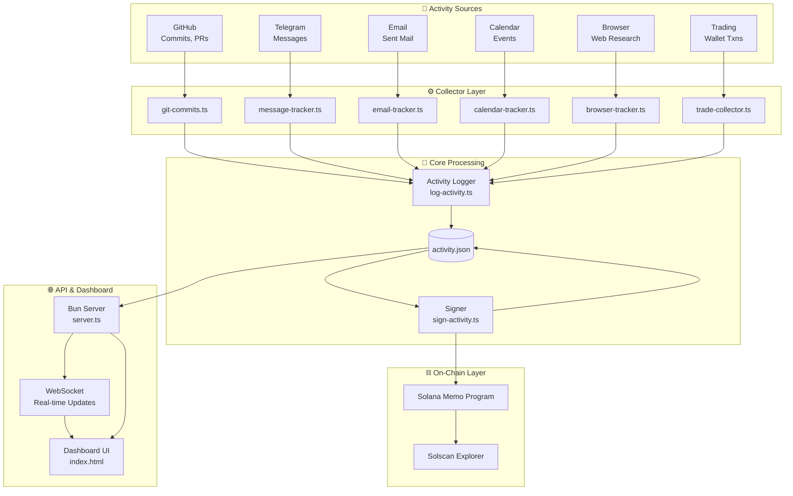
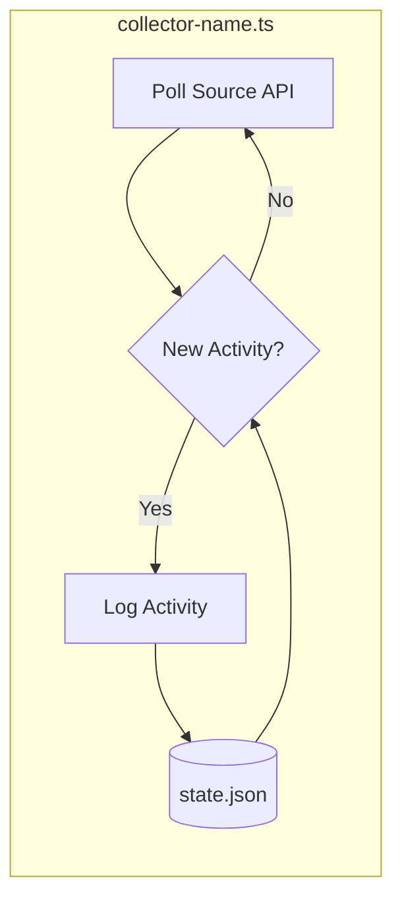
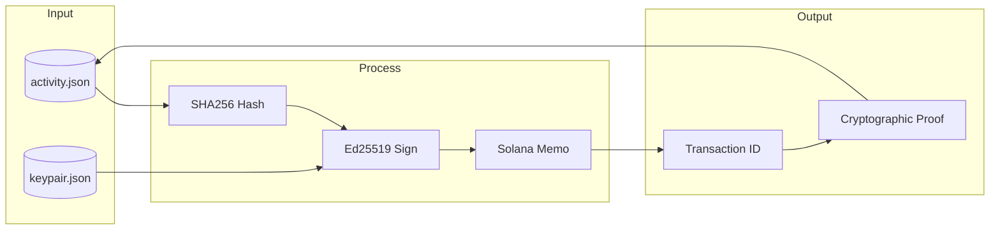
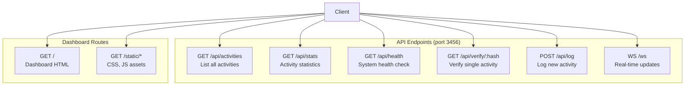
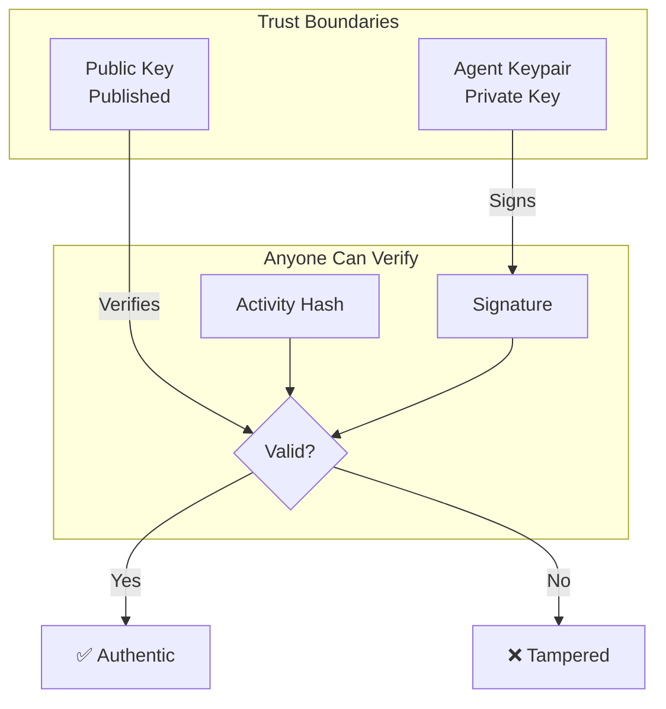

# Proof of Work - System Architecture

This document provides detailed architecture diagrams for the Proof of Work Dashboard system.

## High-Level Overview



## Activity Lifecycle

This sequence diagram shows how a single activity flows through the system:

```mermaid
sequenceDiagram
    autonumber
    participant S as Source<br/>(GitHub, Telegram, etc.)
    participant C as Collector
    participant L as Logger
    participant F as activity.json
    participant SIG as Signer
    participant SOL as Solana
    participant API as API Server
    participant UI as Dashboard

    S->>C: New event detected
    C->>C: Normalize to Activity format
    C->>L: logActivity(type, description, metadata)
    L->>L: Generate SHA256 hash
    L->>F: Append activity record
    
    rect rgb(50, 50, 80)
        Note over F,SOL: On-Chain Signing
        SIG->>F: Read unsigned activities
        SIG->>SIG: Sign hash with Ed25519
        SIG->>SOL: Submit memo transaction
        SOL-->>SIG: Transaction signature
        SIG->>F: Update with txSignature
    end

    F-->>API: File change detected
    API->>UI: WebSocket broadcast
    UI->>UI: Update charts & feed
```



## Component Breakdown

### Collector Layer

Each collector follows the same pattern:



### Signing Flow



### API Endpoints



## Data Flow Summary

| Stage | Input | Output | Storage |
|-------|-------|--------|---------|
| **Collection** | External APIs | Normalized events | State files |
| **Logging** | Activity data | Hashed record | activity.json |
| **Signing** | Hash + keypair | Ed25519 signature | activity.json |
| **Anchoring** | Signature | On-chain memo | Solana blockchain |
| **Serving** | activity.json | JSON/WebSocket | In-memory cache |

## File Structure

```
proof-of-work/
├── api/
│   └── server.ts           # HTTP + WebSocket server
├── collectors/
│   ├── git-commits.ts      # GitHub activity
│   ├── message-tracker.ts  # Telegram messages
│   ├── email-tracker.ts    # Gmail sent folder
│   ├── calendar-tracker.ts # Google Calendar events
│   ├── browser-tracker.ts  # Web research activity
│   ├── log-browser.ts      # Browser logging helper
│   └── types.ts            # Shared TypeScript types
├── scripts/
│   ├── log-activity.ts     # CLI activity logger
│   ├── sign-activity.ts    # On-chain signer
│   └── cron-runner.sh      # Orchestrates all collectors
├── dashboard/
│   ├── index.html          # Main dashboard
│   └── app.js              # Dashboard JavaScript
├── data/
│   ├── activity.json       # Main activity log
│   ├── *-state.json        # Collector state files
│   └── browser-log.json    # Queued browser activities
└── activity.json           # Symlink/copy for API
```

## Security Model



**Key Properties:**
- Only the agent can sign (private key never leaves server)
- Anyone can verify (public key is published)
- Signatures are anchored on Solana (immutable timestamp)
- Activity hashes prevent tampering

---

*This architecture supports the core thesis: transparent, verifiable proof of autonomous agent work.*
